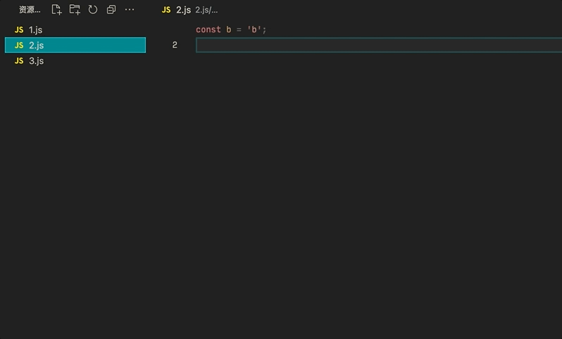
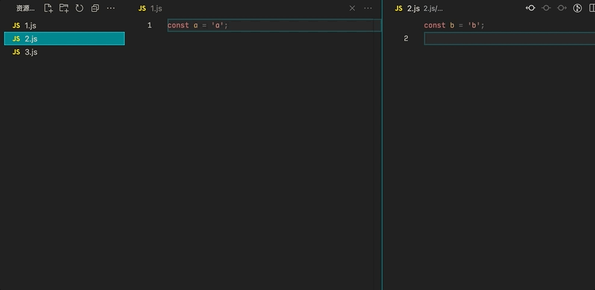

# VSCode Toggle File

A VSCode Extension for quick toggle between two files

## Screenshot

Single editor

<!--  -->


Multi editors

<!--  -->


## How to use

1. Press `cmd/ctrl + shift + p`, and then search `quick toggle file`

2. You can also set shortcuts in `keybindings.json`. like:

```json
[
  // ...
  {
    "key": "ctrl+e",
    "command": "quickToggleFile.toggle"
  }
]
```